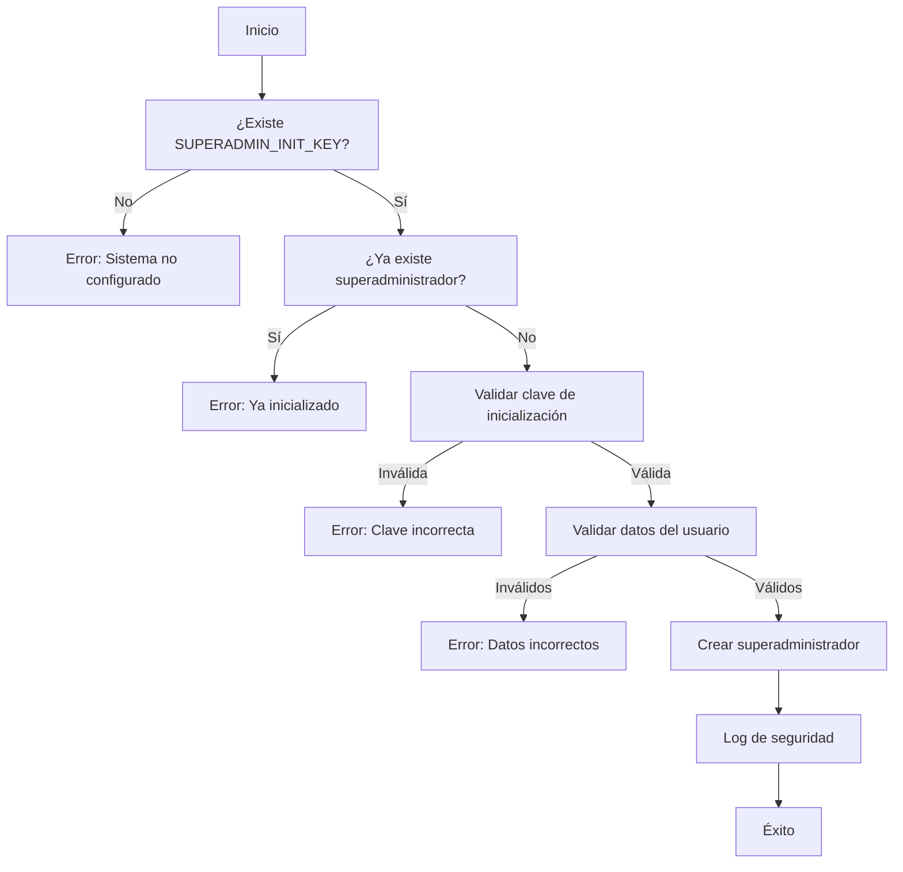

# Inicialización del Primer Superadministrador

Este sistema incluye un mecanismo seguro para crear el primer superadministrador cuando la aplicación se ejecuta por primera vez.

## Configuración Inicial

### 1. Variable de Entorno de Seguridad

Antes de inicializar el sistema, configura la clave de inicialización en tu archivo `.env.local`:

```bash
# Clave secreta para inicializar el primer superadministrador
SUPERADMIN_INIT_KEY=tu_clave_secreta_muy_larga_y_aleatoria_aqui
```

**⚠️ IMPORTANTE:** Esta clave debe ser:
- Larga y completamente aleatoria (mínimo 32 caracteres)
- Mantenida en secreto
- Removida o cambiada después de la inicialización

### 2. Generar Clave Segura

Puedes generar una clave segura usando:

```bash
# En Linux/Mac
openssl rand -hex 32

# En Node.js
node -e "console.log(require('crypto').randomBytes(32).toString('hex'))"
```

## Métodos de Inicialización

### Método 1: Script Interactivo (Recomendado)

Ejecuta el script incluido:

```bash
node scripts/init-superadmin.js
```

Este script:
- ✅ Verifica la configuración del sistema
- ✅ Guía paso a paso la creación del superadministrador
- ✅ Proporciona consejos de seguridad
- ✅ Valida que el sistema no esté ya inicializado

### Método 2: API Directa

Si prefieres usar la API directamente:

#### 2.1 Verificar Estado del Sistema

```bash
curl -X GET http://localhost:3000/api/auth/init-superadmin
```

Respuesta esperada para sistema no inicializado:
```json
{
  "initialized": false,
  "userCount": 0,
  "needsInitialization": true
}
```

#### 2.2 Crear Superadministrador

```bash
curl -X POST http://localhost:3000/api/auth/init-superadmin \
  -H "Content-Type: application/json" \
  -d '{
    "email": "admin@tuempresa.com",
    "password": "contraseña_segura_123",
    "initKey": "tu_clave_secreta_muy_larga_y_aleatoria_aqui"
  }'
```

## Validaciones de Seguridad

### El sistema incluye múltiples capas de seguridad:

1. **Clave de Inicialización**: Solo funciona con la clave correcta
2. **Una Sola Vez**: No permite crear más superadministradores por esta vía
3. **Verificación de Estado**: Confirma que no existan superadministradores previos
4. **Validación de Datos**: Email válido y contraseña de mínimo 6 caracteres
5. **Logging de Seguridad**: Registra todas las operaciones de inicialización

### Protección del Middleware

El middleware protege la aplicación antes de la inicialización:
- Bloquea acceso a APIs de administración si no hay superadministrador
- Retorna error `503 Service Unavailable` con instrucciones
- Permite solo el endpoint de inicialización

## Flujo de Inicialización



## Post-Inicialización

### Acciones Recomendadas

1. **Cambiar o Eliminar la Clave de Inicialización**
   ```bash
   # En .env.local, comenta o elimina la línea:
   # SUPERADMIN_INIT_KEY=tu_clave_secreta_muy_larga_y_aleatoria_aqui
   ```

2. **Verificar Logs de Seguridad**
   - Confirma en los logs del servidor que la inicialización fue exitosa
   - Verifica que solo se realizó una vez

3. **Prueba de Autenticación**
   ```bash
   # Intenta acceder a un endpoint protegido
   curl -X GET http://localhost:3000/api/admin/users
   # Debe retornar 401 sin autenticación válida
   ```

4. **Crear Usuarios Adicionales**
   - Usa el superadministrador creado para gestionar otros usuarios
   - No uses el superadministrador para operaciones cotidianas

## Solución de Problemas

### Error: "Sistema no configurado"
- Verifica que `SUPERADMIN_INIT_KEY` esté en `.env.local`
- Reinicia el servidor de desarrollo

### Error: "Ya existe un superadministrador"
- El sistema ya fue inicializado
- Usa las credenciales existentes o contacta al administrador

### Error: "Clave de inicialización inválida"
- Verifica que la clave enviada coincida con `SUPERADMIN_INIT_KEY`
- Asegúrate de no tener espacios extra en la variable de entorno

### Error: "Datos inválidos"
- Email debe tener formato válido
- Contraseña debe tener mínimo 6 caracteres

## Seguridad en Producción

### Consideraciones Adicionales

1. **HTTPS Obligatorio**: Nunca envíes credenciales por HTTP en producción
2. **Rotación de Claves**: Cambia `NEXTAUTH_SECRET` regularmente
3. **Monitoreo**: Implementa alertas para intentos de inicialización
4. **Backup**: Asegúrate de tener respaldos de la base de datos
5. **Auditoría**: Revisa regularmente los logs de autenticación

### Variables de Entorno Críticas

```bash
# Requeridas para producción
NEXTAUTH_SECRET=clave_secreta_para_jwt
NEXTAUTH_URL=https://tu-dominio.com
MONGODB_URI=mongodb://tu-conexion-mongodb

# Solo para inicialización (remover después)
SUPERADMIN_INIT_KEY=clave_temporal_para_inicializar
```

---

**⚡ Inicio Rápido:**

1. `SUPERADMIN_INIT_KEY=mi_clave_secreta_123` en `.env.local`
2. `npm run dev`
3. `node scripts/init-superadmin.js`
4. Seguir las instrucciones
5. ¡Listo! 🎉